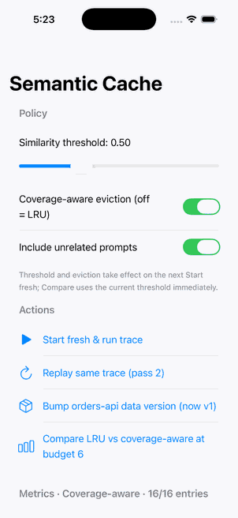

# semantic-response-cache-kit-demo-app

**Watch a cache measure whether it is serving wrong answers — then drop the threshold and watch it catch one — on device, with no server in the loop.**

[](https://github.com/rajatslakhina/semantic-response-cache-kit-demo-app/actions/workflows/ci.yml)

This is the runnable companion to [**semantic-response-cache-kit**](https://github.com/rajatslakhina/semantic-response-cache-kit). It is a separate Xcode project in a separate repository that consumes the library as a **remote Swift Package pinned to a release tag** (`from: 1.0.0`, `upToNextMajorVersion`) — never a local path, never `branch: main`. If this app builds, the package genuinely resolves from GitHub the way a third party's would.

## Why this matters

A semantic cache is the first cache most iOS engineers will build where correctness is a tuning parameter rather than a property: the prompt is embedded and a stored answer is returned when cosine similarity clears a threshold. On device there is no gateway to compute the false-hit rate from logs, no cross-user warming to shorten cold start, no elastic storage, and — with Foundation Models at zero token cost — no dollars being saved, only latency and battery, which means the cache has to prove it is faster than the generation it skips. The library is the system design that follows from those constraints; this app is where you can see each part of it move.

## What the screen shows

Launch it and it runs a 30-prompt support trace (26 paraphrases of 8 topics, interleaved so consecutive prompts are different topics, plus 4 unrelated prompts) through a fresh `SemanticCache` with a **250 ms simulated generator**, then shows every row tagged **MISS**, **SEMANTIC** (with the similarity and the prompt it matched), **EXACT**, **STALE** or **SHARED**, and a metrics panel with:

- hit rate, exact vs semantic hits, misses, evictions, stale rejections;
- **shadow samples and disagreements**, and the false-hit rate as a **95% Wilson interval** (the demo shadows 100% of semantic hits so the interval fills in fast; production would sample 2–5%);
- **mean lookup vs mean generation** and the **break-even verdict** — whether the cache is saving time per request or adding it;
- the **threshold advisor's** recommendation (`raise` / `hold` / `could lower` / `need N more samples`).

Then the buttons:

| Button | What it demonstrates |
|---|---|
| **Replay same trace (pass 2)** | The second pass is where a per-user cache earns its keep: at the launch settings 27 of the same 30 prompts now hit — 15 on the exact tier, 12 on the vector tier — and the 3 unrelated-or-evicted ones regenerate. Hit rate jumps; mean lookup drops below mean generation. |
| **Bump orders-api data version** | Simulates the orders API's data moving. The generator now stamps answers `v2`; the cache is told. On the next replay every answer grounded on `v1` is rejected as **STALE** and regenerated — while answers grounded on `pricing-api` or on nothing are untouched. Provenance edges, not TTLs. |
| **Compare LRU vs coverage-aware at budget 6** | Runs the trace twice under each eviction policy with only 6 slots and reports second-pass hit rates side by side. On this corpus at threshold 0.50 (this comparison runs without shadow sampling): **LRU 10.0% (3/30) vs coverage-aware 46.7% (14/30)**. |
| **Threshold slider → Start fresh** | Set it to **0.92** (the server-side number) and watch semantic hits go to zero. Set it to **0.45** and press **Start fresh**: on this corpus the launch pass alone produces a **FALSE HIT** row (1 disagreement in 13 shadow samples) that the cache replaces on the spot. At the default 0.50 the sampler finds none across three passes (0 in 36), which is the point of the default. At 0.45 the Wilson upper bound blows past the 2% tolerance immediately, but the advisor refuses to recommend anything until it has 30 shadow samples (the launch pass gives 13, one replay ~27), so it takes two replays before it says *raise*. The right threshold is a property of the embedder. |

## Screenshots



**One real screenshot, honestly scoped.** The scheduled run that built these repos could not drive Xcode or the Simulator (`request_access` was refused three times: *"Computer-use access … can't be approved during a scheduled run"*). In a follow-up interactive session on the same day the access was granted, `Demo.xcodeproj` was opened in Xcode 26.3, the remote package resolved from GitHub as **semantic-response-cache-kit 1.0.1**, and the **Demo** scheme was run on an **iPhone 17 Pro (iOS 26.3) Simulator**. The app launched, the launch trace ran, and the image above was captured with Simulator's *File → Save Screen* — it is what appeared, not a mockup.

What the screenshot does and does not show:

- **Shows:** the app launched and the launch replay completed — the metrics header reads *Coverage-aware · 16/16 entries*, which is the cache at its 16-entry budget after the 30-prompt trace.
- **Does not show:** the metrics rows or the per-prompt trace list below the fold, or any button interaction. Clicks into the Simulator window were blocked by the automation's permission gate during that session, so the four actions were **not** exercised by hand. Their behaviour is asserted by the library's tests and traced by the independent review, not by a screenshot.
- The committed PNG is a 302 px, 32-colour copy (12 KB) — it was transferred through a bandwidth-limited channel; the full-resolution 1206×2622 original is kept locally.

## How to run it

```bash
git clone https://github.com/rajatslakhina/semantic-response-cache-kit-demo-app.git
cd semantic-response-cache-kit-demo-app
open Demo.xcodeproj
```

1. Xcode resolves `semantic-response-cache-kit` from GitHub (pinned `from: 1.0.0`).
2. Select the **Demo** scheme (it is shared and committed, so it appears on a fresh clone).
3. Pick any iOS 16+ Simulator and **Build & Run** (the project's deployment target is iOS 16.0, matching the package).
4. The trace runs on launch. Then press **Replay**, **Bump**, **Compare**, and move the threshold slider.

Requires Xcode 16+ (Swift 6). No signing team is needed for a Simulator build.

## What's in the repo

```
Demo.xcodeproj/project.pbxproj                          hand-written; objectVersion 60, remote package reference pinned to 1.0.0
Demo.xcodeproj/xcshareddata/xcschemes/Demo.xcscheme     shared scheme
Demo/DemoApp.swift                                      @main App; owns the launch configuration, hands it to the library's view
Demo/Screenshots/launch-trace-iphone-17-pro.png         the one real Simulator screenshot (see Screenshots)
.github/workflows/ci.yml                                macos-15: resolve remote package → build for generic/platform=iOS Simulator
```

`DemoApp.swift` imports both `SemanticResponseCache` and `SemanticResponseCacheUI`: the launch configuration is validated through the core module's own `CachePolicy` / `ShadowConfiguration` rules (via `ExplorerDefaults.init`), and if that ever fails the app shows a readable fallback screen naming the core `CacheError` rather than crashing. The `.failure` branch is unreachable with the shipped constants; it exists so editing them can never turn a typo into a launch crash.

## Verification — exactly what happened

- `project.pbxproj` was machine-checked before pushing: braces 33/33, parens 24/24, 22 object ids all defined, zero dangling references, one `XCRemoteSwiftPackageReference` at `https://github.com/rajatslakhina/semantic-response-cache-kit.git` with `kind = upToNextMajorVersion; minimumVersion = 1.0.0`, no local package reference, exactly one target (the `Demo` iOS app), no test or tool targets.
- **CI:** one `macos-15` job — `xcodebuild -resolvePackageDependencies`, print `Package.resolved`, then `xcodebuild build -scheme Demo -destination 'generic/platform=iOS Simulator'`. The live result is on the [Actions tab](https://github.com/rajatslakhina/semantic-response-cache-kit-demo-app/actions); the resolved-version step in the log shows which library release it actually pulled.
- **Simulator launch:** happened once, in an interactive follow-up session — Xcode 26.3, iPhone 17 Pro (iOS 26.3), package resolved at 1.0.1, app launched and ran its launch trace; one screenshot captured (see Screenshots). Buttons were **not** exercised by hand.
- The library's own verification (57 XCTest cases on Linux, warnings-as-errors clean build, iOS compile) is documented in [its README](https://github.com/rajatslakhina/semantic-response-cache-kit#verification--what-actually-happened).

## License

MIT — see [LICENSE](LICENSE).
